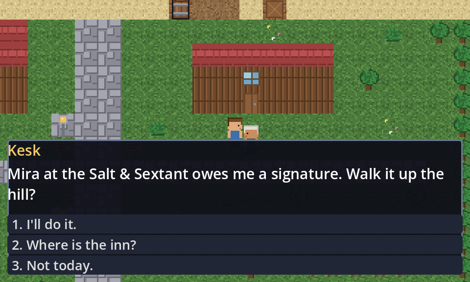

# Port Azure

A SNES-era tile RPG in Godot 4, built and validated entirely by headless
GitHub Actions runners. Nothing runs on your machine and nothing runs in the
cloud between builds — the runner wakes up, builds, publishes, and disappears.

**Play it:** https://vprndsg.github.io/godot-rpg-ci/ *(live once Pages is enabled — see setup below)*



*The screenshot above is the actual web export, driven in headless Chromium.*

```
                    you
                     │
              GitHub issue: "@claude add a bakery to Port Azure"
                     │
              GitHub Actions runner
        ┌────────────────────────────────┐
        │  Claude Code                   │
        │      ↓                         │
        │  edits maps/ data/ dialogue/   │
        │      ↓                         │
        │  godot --headless  (import)    │
        │      ↓                         │
        │  tools/ci.sh test              │
        └──────────────┬─────────────────┘
                       │
                  pull request
                       │
              Test workflow: import → validate → web export
                       │
                    merge
                       │
              Deploy workflow → GitHub Pages
                       │
                 playable game
```

## Setup

Four things, once.

**1. Add your Anthropic credentials.** In *Settings → Secrets and variables →
Actions*, add a repository secret named `ANTHROPIC_API_KEY`. If you would
rather authenticate with a Claude subscription, add
`CLAUDE_CODE_OAUTH_TOKEN` instead and swap the commented line in
`.github/workflows/claude.yml`.

**2. Install the Claude GitHub App** on this repository, so `@claude` mentions
reach the workflow. The quickest route is `/install-github-app` from Claude
Code in a terminal; it walks through the app and the secret together.

**3. Turn on Pages.** *Settings → Pages → Build and deployment → Source:
**GitHub Actions***. The deploy workflow does the rest on every push to `main`.

**4. Allow Actions to write.** *Settings → Actions → General → Workflow
permissions → Read and write permissions*, so Claude can push branches and
open pull requests.

## Using it

Open an issue and mention `@claude`:

> **@claude** Build a two-storey inn in Port Azure. Ground floor has six
> tables, a bartender, a fireplace and stairs. Upstairs has four rooms. Use the
> existing interior tileset. Add collision and doorway transitions. Do not
> modify the surrounding town.

Claude reads `CLAUDE.md` and the skills in `.claude/skills/`, edits the map and
dialogue JSON, runs the headless test suite until it is green, and opens a pull
request. CI re-validates and builds the web export. Merging publishes it.

You can also mention `@claude` in a pull request comment to ask for changes.

## Working on it locally

You do not need the Godot editor, but you do need the binary.

```bash
tools/ci.sh setup     # downloads Godot 4.7.2 + the web export templates
tools/ci.sh import    # re-import assets
tools/ci.sh test      # the whole suite, ~2 seconds
tools/ci.sh export    # web build into build/web/
```

To play the web build locally:

```bash
tools/ci.sh export && npx http-server build/web -p 8080 -c-1
```

If you *do* have the editor, `godot project.godot` works normally — but keep
map content in `maps/*.json` rather than painting a `TileMapLayer`, or the
headless loop stops working. `CLAUDE.md` explains why.

## How it is laid out

```
maps/*.json           towns and interiors as ASCII grids with a legend
data/npcs/*.json      who each character is
dialogue/*.json       what they say, as a node graph with flags
assets/tiles/         tiles.json is the source of truth; the png and tres are generated
assets/sprites/       character sheet, also generated
scripts/              game code; map_data.gd holds the map validator
scenes/               player, npc, dialogue box, world, title
tests/                the suite that gates every merge
tools/                gen_art.py, build_tileset.gd, setup_input.gd, ci.sh
.claude/skills/       build-map, create-npc, create-quest, test-game
```

Content is data, not scenes. A `TileMapLayer` stores its cells as a binary
blob that cannot be read or reviewed in a diff, which makes it useless to an
agent working headlessly — so maps are ASCII and `scripts/map_loader.gd` builds
the tile layers at runtime.

## What the tests actually catch

Beyond "it parses": a flood fill from each map's spawn point must reach every
door, NPC and sign. That is what catches a staircase sealed behind a table or
an NPC walled into a closet — the failures you cannot see in a text diff and
would otherwise only find by playing. The runtime suite goes further and boots
the real game headlessly: it walks the player into walls, steps through every
door, and stands next to every interactable to confirm it responds.

## Adding browser testing later

The suite proves the game is correct. It cannot prove it *looks* right. When
you want that, add Playwright: serve `build/web`, drive Chromium, screenshot,
and assert there are no console errors. It runs on the same runners and needs
no server. The export is already single-threaded (`variant/thread_support=false`
in `export_presets.cfg`) so it runs on Pages without cross-origin isolation
headers, which also means Playwright can load it from a plain static server.

## Credits

Godot Engine 4.7.2 (MIT). Art and code in this repository are generated from
`tools/gen_art.py` and the scripts under `scripts/`.
